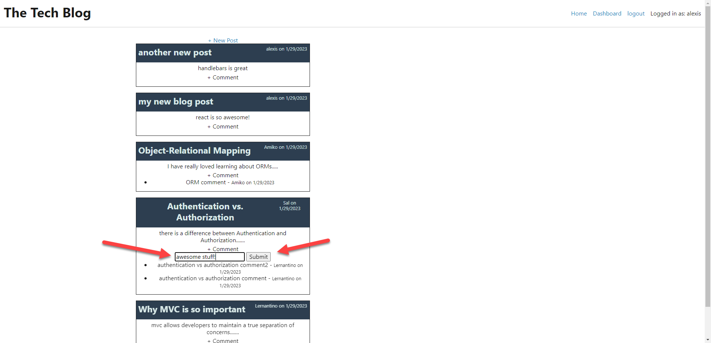

# Model-View-Controller (MVC) Challenge 14: Tech Blog


Deployed site on Heroku:
https://cms-tech-blog.herokuapp.com/
     
## Table of Contents

- [Description](#description)
- [Installation](#installation)
- [Usage](#usage)
- [Credits](#credits)
- [License](#license)
- [Features](#features)
- [How-to-Contribute](#how-to-contribute)
- [Tests](#tests)
- [Questions](#questions)

## Description
```md
The task for this assignment was to build a CMS-style blog site similar to a Wordpress site, where developers can publish their blog posts and also comment on other developers’ posts.
```

**User Story**

```md
AS A developer who writes about tech
I WANT a CMS-style blog site
SO THAT I can publish articles, blog posts, and my thoughts and opinions
```

**Acceptance Criteria**

```md
GIVEN a CMS-style blog site
WHEN I visit the site for the first time
THEN I am presented with the homepage, which includes existing blog posts if any have been posted; navigation links for the homepage and the dashboard; and the option to log in
WHEN I click on the homepage option
THEN I am taken to the homepage
WHEN I click on any other links in the navigation
THEN I am prompted to either sign up or sign in
WHEN I choose to sign up
THEN I am prompted to create a username and password
WHEN I click on the sign-up button
THEN my user credentials are saved and I am logged into the site
WHEN I revisit the site at a later time and choose to sign in
THEN I am prompted to enter my username and password
WHEN I am signed in to the site
THEN I see navigation links for the homepage, the dashboard, and the option to log out
WHEN I click on the homepage option in the navigation
THEN I am taken to the homepage and presented with existing blog posts that include the post title and the date created
WHEN I click on an existing blog post
THEN I am presented with the post title, contents, post creator’s username, and date created for that post and have the option to leave a comment
WHEN I enter a comment and click on the submit button while signed in
THEN the comment is saved and the post is updated to display the comment, the comment creator’s username, and the date created
WHEN I click on the dashboard option in the navigation
THEN I am taken to the dashboard and presented with any blog posts I have already created and the option to add a new blog post
WHEN I click on the button to add a new blog post
THEN I am prompted to enter both a title and contents for my blog post
WHEN I click on the button to create a new blog post
THEN the title and contents of my post are saved and I am taken back to an updated dashboard with my new blog post
WHEN I click on one of my existing posts in the dashboard
THEN I am able to delete or update my post and taken back to an updated dashboard
WHEN I click on the logout option in the navigation
THEN I am signed out of the site
WHEN I am idle on the site for more than a set time
THEN I am able to view comments but I am prompted to log in again before I can add, update, or delete blog posts
```

## Installation
<!-- audience is other developers -->

1. Clone this GitHub repo https://github.com/abrownstein2022/ch14-mvc-cms-blog
<!-- Check out the gh cli tool from github -->
```bash
$ gh repo clone https://github.com/abrownstein2022/ch14-mvc-cms-blog
```

2. From the terminal, install npm:
```bash
$ npm install
``` 

3. Log into mysql, create the database on your local machine and seed the database:

```bash
$mysql -u root -p < db/schema.sql
$npm run seed-database
```

<!-- [] implies user input 
 mysql> restaurant_mgr < C:\[filename].sql
-->

4. Start the local server and watch for file changes to automatically restart server (nodemon):
```bash
$ npm run watch 
```
  
5. Open browser to test any changes you make to the application after cloning.


## Usage  
The tech blog is deployed on Heroku and has been seeded with initial seed data.  Click on the link below to start the application.  Or clone and use from your vs-code.
https://cms-tech-blog.herokuapp.com/

Or to start with nodemon

```bash
$npm run dev
```

**The screenshots below show the functionality of the application:**<br>
Homepage opens for all users showing all posts and comments but no one can update data without logging in.


User must register on the website to enter posts, update and delete their posts, and add comments to other user posts.


New user signup.


Dashboard displays after user login, showing the logged in user's posts.


New user's first blog post.


New user's second blog post.


Dashboard display of new user after 2 new posts added.


New user comments on another user's post.


Homepage display after new user entered comments on another user's post.


Display posted comment.


New user updates their own post.


Display shows latest update works.


The new user deletes one of their posts.<br>


Display dashboard after new post has been deleted.


## Credits

```md
Alexis Brownstein, Wyzant tutor: Mike
```

## License

 ```md
 MIT 
```

Link to license text:
https://opensource.org/licenses/mit-license


## Features 

<!-- 
# h1
###### h6
**bold**
*italic*
_underline_

| key | value |
|-|-|
| name | 'bob' |


- list
- items

1. numberd
1. list
1. all ones - automatic numbering
Features for *future* development
 -->
**The main features in this project are:**<br> 
1. Uses Node.js, handlebars, sequelize/mySQL, npm for authentication, Heroku for deployed website
1. Example screenshots with description of application functionality 
1. Necessary MVC folder structure 
1. Professional README
1. User credentials saved to log into the site
1. Timeout after 5 minutes of inactivity
## How-to-Contribute

N/A

## Tests
N/A

## Questions

Feel free to contact me with any questions.

I can be reached at alexis@drdatabase.com.

This GitHub repo can be found at:
  
https://github.com/abrownstein2022/ch14-mvc-cms-blog

